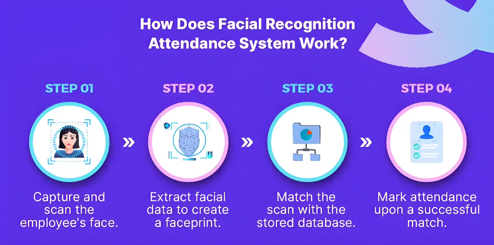

    

<h1 align="center">🧠 AI FACE ATTENDANCE SYSTEM 🧑‍ attendance</h1>

  <a href="https://github.com/AnshulSharma9340/Face-Based-Attendance-Attribute-System/issues">🐛 Report Bug</a>
  •
  <a href="https://github.com/AnshulSharma9340/Face-Based-Attendance-Attribute-System/issues">💡 Request Feature</a>

<h2 id="overview">🔍 Overview</h2>

> The **AI Face Attendance System** is an advanced, real-time solution built with **Python** and **Deep Learning** models. It goes beyond simple identification by integrating **Age, Gender, and Emotion Detection** with automated attendance marking. The system features an interactive web interface powered by **Flask** and a **SQLite** database for robust data management.

  

<h2 id="project-insights">📊 Project Insights</h2>

<table align="center">
  <thead align="center">
    <tr>
      <td><b>🌟 Stars</b></td>
      <td><b>🍴 Forks</b></td>
      <td><b>📚 Main Language</b></td>
      <td><b>📄 License</b></td>
      <td><b>🧑‍💻 Activity</b></td>
    </tr>
  </thead>
  <tbody>
    <tr>
      <td></td>
      <td></td>
      <td></td>
      <td></td>
      <td></td>
    </tr>
  </tbody>
</table>

<h2 id="key-features">🌟 Key Features</h2>

The system leverages deep learning and computer vision to provide a multi-faceted attendance solution:

* **🎭 Real-time Face Recognition**: Detects and identifies registered individuals via live camera feed using **dlib** and `face-recognition`.
* **🕒 Automated Attendance Marking**: Automatically marks **Present** in the SQLite database upon successful face verification.
* **🧓 Attribute Detection**: Predicts **Age**, **Gender** (Male/Female), and **Emotion** (Happy, Sad, Angry, Neutral, etc.) for deeper insights.
* **💾 Robust Data Storage**: Utilizes a **SQLite database (`attendance.db`)** to securely store user profiles and attendance logs.
* **🌐 Interactive Web Interface**: A full **Flask** application with **HTML/CSS/JS** for:
    * Admin/Professor Dashboards (`admin_dashboard.html`, `professor_dashboard.html`).
    * Student/Professor Management (`add_student.html`, `professors.html`).
    * Live Attendance View (`live.html`).
    * Manual Attendance and Log Tracking (`manual_attendance.html`, `log.html`).
* **⚙️ Pre-trained Deep Learning Models**: Uses specialized **TensorFlow/Keras** models for highly accurate attribute prediction.

## 🏗️ Project Architecture & Flow

The system follows a typical MVC pattern, facilitated by the **Flask** framework, to manage the data flow from the camera to the database and back to the web interface.

### 🧭 Working Flow
1.  **Capture**: `live_attendance_module.py` captures the live video stream using **OpenCV**.
2.  **Detection & Encoding**: Faces are detected, and their embeddings are compared against pre-calculated encodings stored in `known_face_encodings.pkl`.
3.  **Attribute Prediction**: Deep learning models are used to determine age, gender, and emotion.
4.  **Database Update**: Upon successful recognition, the `attendance.db` database is updated by the utility scripts.
5.  **Web Display**: The `app.py`, `manager_app.py`, and `student_manager_app.py` Flask routes render the results to the various HTML templates in the `/templates` folder.

### 📁 Core Structure

├── .gitignore
├── CODE_OF_CONDUCT.md
├── CONTRIBUTING.md
├── LICENSE
├── README.md
├── __pycache__
    ├── database_utils.cpython-312.pyc
    ├── shared_state.cpython-312.pyc
    └── utils.cpython-312.pyc
├── app.py
├── attendance.db
├── data
    ├── sample.csv
    ├── sample.txt
    ├── sample.xlsx
    ├── sample.xml
    └── sample_excel.xlsx
├── database_setup.py
├── dlib-19.22.99-cp39-cp39-win_amd64.whl
├── git
├── known_face_encodings.pkl
├── live_attendance_module.py
├── manager_app.py
├── output
    ├── output.csv
    ├── output.txt
    ├── output_excel.xlsx
    └── web_data.csv
├── requirements.txt
├── static
    ├── images
    │   ├── face_scan_background.png
    │   └── how_facial_recognition_works.png
    ├── style-3d.css
    └── style.css
├── student_manager_app.py
├── templates
    ├── add_professor.html
    ├── add_student.html
    ├── admin_dashboard.html
    ├── base.html
    ├── configure_session.html
    ├── dashboard.html
    ├── edit_professor_profile.html
    ├── edit_student.html
    ├── landing.html
    ├── layout.html
    ├── live.html
    ├── log.html
    ├── login.html
    ├── manual_attendance.html
    ├── professor_dashboard.html
    ├── professor_profile.html
    ├── professors.html
    ├── schedule.html
    └── students.html
└── tesnorflow.ipynb

<h2 id="technologies-used"> 🛠️ Technologies Used</h2>

### Backend & Core Logic

### Frontend & Utilities

<h2 id="installation-setup"> ⚙️ Installation & Setup </h2>

### 📋 Prerequisites

Ensure you have **Python 3.x** installed. The project relies on specific versions of libraries like `dlib`, which can sometimes require system-level dependencies.

### 1. Clone the Repository

git clone [https://github.com/AnshulSharma9340/Face-Based-Attendance-Attribute-System.git](https://github.com/AnshulSharma9340/Face-Based-Attendance-Attribute-System.git)
cd Face-Based-Attendance-Attribute-System
2. Create and Activate Virtual Environment
It is highly recommended to use a virtual environment.

python -m venv venv
# For Linux/macOS
source venv/bin/activate
# For Windows
venv\Scripts\activate
3. Install Dependencies
Install all required packages. Note: dlib can take a while to install. The provided .whl file (dlib-19.22.99-cp39-cp39-win_amd64.whl) is for Python 3.9 on Windows 64-bit; you may need to install the library directly if your setup differs.

pip install -r requirements.txt
4. Run the Application
Execute the main Flask application file.

python app.py
Then open your browser and visit 👉 http://127.0.0.1:5000/ to access the web interface.

<h2 id="screenshots"> 📸 Screenshots </h2>

Placeholder: Add your project screenshots here (e.g., dashboard, live feed, etc.)

  

<h2 id="future-enhancements">💡 Future Enhancements</h2>

Improve age/gender/emotion model accuracy with transfer learning on a larger, domain-specific dataset.

Implement real-time reporting via WebSockets for the live attendance page.

Integrate a richer database like PostgreSQL or MySQL.

Add multi-factor authentication for admin and professor logins.

<h2 id="contribution-guidelines">🤝👤 Contribution Guidelines</h2>

We welcome all contributions! Please check out the existing guidelines:

Code of Conduct: CODE_OF_CONDUCT.md

Contributing: CONTRIBUTING.md

Ways to Contribute
🐛 Bug Fixes: Help squash bugs in the recognition module or the web application.

✨ New Features: Suggest and implement new features (e.g., real-time graphs, advanced reporting).

📚 Documentation: Improve guides and explanations.

<h2 id="license">📄 License</h2>

This project is licensed under the Apache License 2.0 - see the LICENSE file for details.

<h2 id="author">🧑‍🏫 Author</h2>

Anshul | B.Tech in Data Science | AI & Software Engineering and Machine Learning Enthusiast

📧 Contact: anshulsharma7162@gmail.com

<h2 align="center"> 
<b> Show some  by starring this awesome repository! 
 </h2>

 <a href="#top" style="font-size: 18px; padding: 8px 16px; display: inline-block; border: 1px solid #ccc; border-radius: 6px; text-decoration: none;"> ⬆️ Back to Top </a> 

